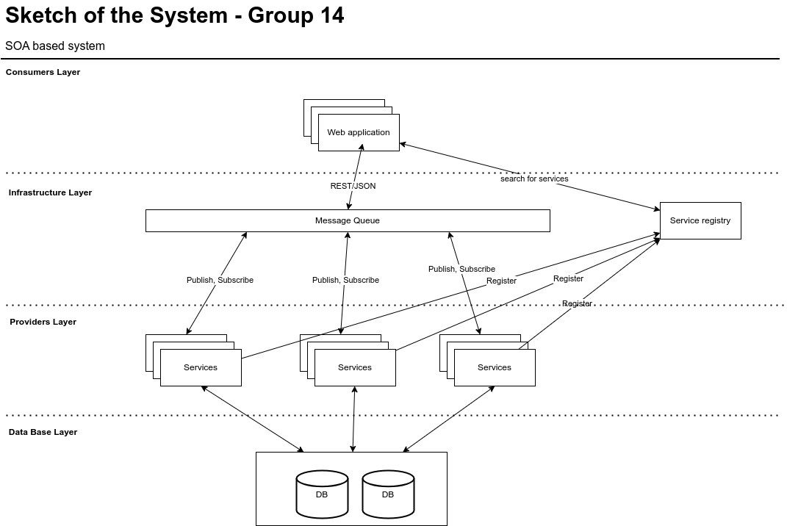

# 4471_Group14_ProjectDocumentation

## Documentation
1. progress report 1: https://docs.google.com/presentation/d/1a1noWDl2Q8BtTN-QjLv9B6lB9XAHVoiMkznkSdKGMHo/edit#slide=id.g24fa5f57760_0_5
2. system preliminary sketch:

3. gantt chart: https://app.smartsheet.com/sheets/7V7r996fhwxhQVQmcVPr347QMqv8M8Vcqc3PGw21?view=gantt

## Local Deploy Test
1. open multiple terminals, using `python3 user_service.py` to start services
2. using `python3 client.py` to open an client connect and invoke the service

## Remote Deploy Test
### General Procesures
Using python with Flask, AWS EC2 instances, Nginx, we will be able to deployed the local service to a server
1. create EC2 instance, create security group, modify the inbound rules to let the ports for service accessible
2. using scp to transfer files to server, and then runing the service on a server locallly (localhost of server)
3. setup Nginx server to transfer public HTTP request to server's localhost
4. modify the public ip of the remote_client.py, and then run it locally to see the result.

### set up nginx
1. make sure EC2 instance has the right inbound rule for the port opening for tcp connection (use hello-world.py to test nginx)
2. create nginx server rule accordingly, below is an example, modify the 8500 to your port!
```bash
server {
    listen 8500;
    listen [::]:8500;

# SSL configuration
#
# listen 443 ssl default_server;
# listen [::]:443 ssl default_server;
#
# Note: You should disable gzip for SSL traffic.
# See: https://bugs.debian.org/773332
#
# Read up on ssl_ciphers to ensure a secure configuration.
# See: https://bugs.debian.org/765782
#
# Self signed certs generated by the ssl-cert package
# Don't use them in a production server!
#
# include snippets/snakeoil.conf;

    root /home/ubuntu;

    location / {
# First attempt to serve request as file, then
# as directory, then fall back to displaying a 404.
        proxy_pass http://127.0.0.1:5000;
        proxy_set_header Host $host;
        proxy_set_header X-Real-IP $remote_addr;
    }

# pass PHP scripts to FastCGI server
#
#location ~ \.php$ {
#	include snippets/fastcgi-php.conf;
#
#	# With php-fpm (or other unix sockets):
#	fastcgi_pass unix:/var/run/php/php7.4-fpm.sock;
#	# With php-cgi (or other tcp sockets):
#	fastcgi_pass 127.0.0.1:9000;
#}

# deny access to .htaccess files, if Apache's document root
# concurs with nginx's one
#
#location ~ /\.ht {
#	deny all;
#}
}
```
3. restart the nginx to make the rules take into effect
```bash
# root previlage to edit the server rule
sudo vim /etc/nginx/sites-available/user_service_app
# create a soft link of the rule
sudo ln -s /etc/nginx/sites-available/user_service_app /etc/nginx/sites-enabled/
# reload the nginx server to make the rules take into effect
sudo service nginx reload
sudo systemctl restart nginx
# test nginx rules
sudo nginx -t
```

### Remote Deploy Test Procedure
1. After setting up the EC2 instance and nginx rules, using ssh to connect to the servers
2. using `python3 xxx.py` to start the service
3. open a terminal locally, modify the remote_client.py to use the public IP that you set up
4. using `python3 remote_client.py` to start a local service, if it is successful, you should be able to see below output
```bash
--> python3 remote_client.py
start!
Created User: {'user_id': 2}
Retrieved User: {'email': 'john@example.com', 'username': 'john_doe'}
Created Product: {'product_id': 2}
Retrieved Product: {'name': 'Example Product', 'price': 19.99}
```

Note:
Hello world program is provided, to test public access through HTTP request

## AWS IaaS servies can be used
1. code deployment, auto scaling etc: https://www.youtube.com/watch?v=_EUZss7ZAS8
2. create EC2: https://www.youtube.com/watch?v=0Gz-PUnEUF0  (**Note: only Ubuntu is free tier!** and Ubuntu20.04LTS is recommanded!)
3. using Linux connect to the EC2 instances: https://www.youtube.com/watch?v=hnBLu8wwOVA
